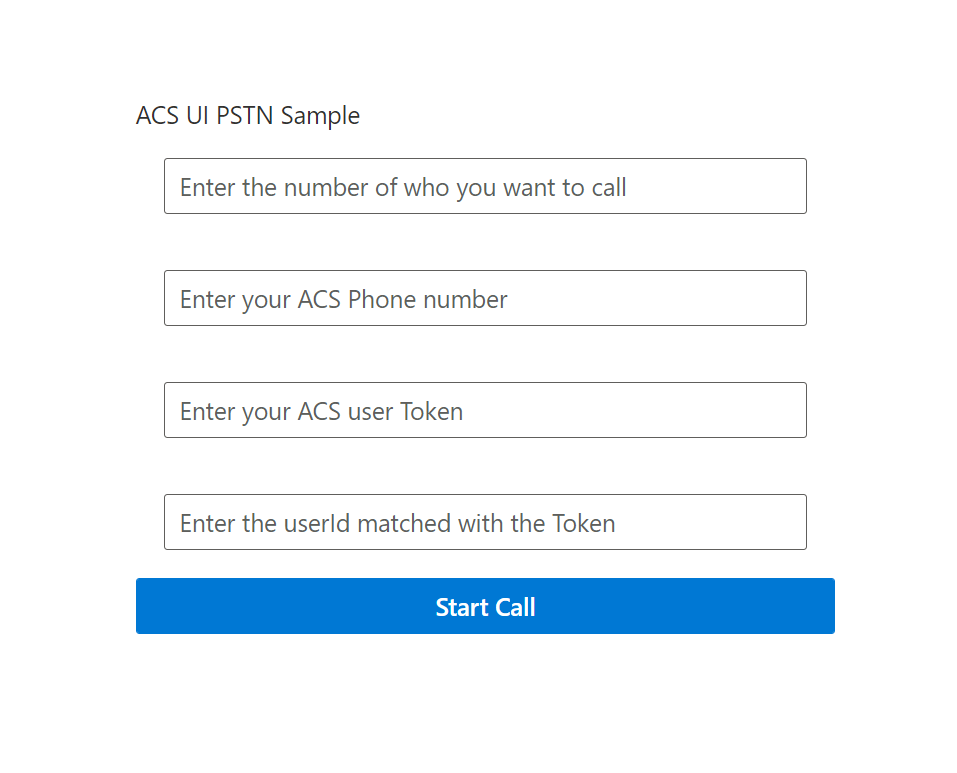

# PSTN Proof of concept for Azure Communication-react UI Library

This repo is to demonstrate how to use PSTN calling with the [ACS React UI library](https://github.com/Azure/communication-ui-library).

## Instructions on how to run it

- Clone the repository
- run the following:
    - ```npm install yarn```
    - ```yarn install```
    - ```yarn start```

## Instructions on how to start a call
Once you have the application running you will be greeted with this screen on `localhost:3000`



you will need 4 things: 
- An ACS requisitioned phone number
- An ACS token from the same ACS resource as the phone number
- The `userIdentifier` that goes with the token
- The number that you would like to call

Once you have entered the information into the fields and press the `Start Call` button the app will dial out to that number. 

